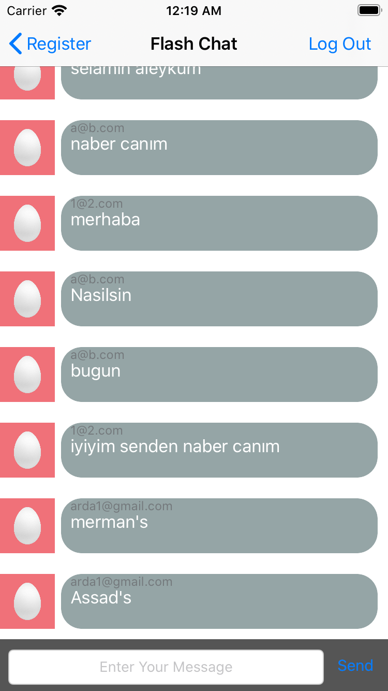

# Flash-Chat

It is an ios app named as Flash-Chat based on Whatsapp. You can send messages to one person and can be able to get his/her messages instantly. All messages are also stored in firebase rdbms provided by Google. 

Firebase authentication and realtime database are used for the backend part. 

Created using swift 4.

If you want to launch it, clone it and install pods in podfile for the firebase.

 
